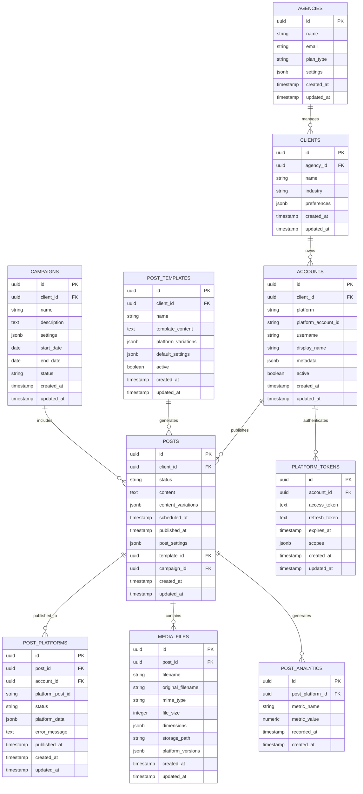

# Database Schema Design

## Overview

PostgreSQL database schema optimized for multi-platform social media automation with support for scheduling, analytics, and client management.

## Entity Relationship Diagram



## Table Definitions

### Agencies Table
Primary entity for the SaaS multi-tenant architecture.

```sql
CREATE EXTENSION IF NOT EXISTS "uuid-ossp";

CREATE TABLE agencies (
    id UUID PRIMARY KEY DEFAULT uuid_generate_v4(),
    name VARCHAR(255) NOT NULL,
    email VARCHAR(255) UNIQUE NOT NULL,
    plan_type VARCHAR(50) NOT NULL DEFAULT 'starter', -- starter, professional, enterprise
    settings JSONB DEFAULT '{}',
    created_at TIMESTAMP WITH TIME ZONE DEFAULT NOW(),
    updated_at TIMESTAMP WITH TIME ZONE DEFAULT NOW()
);

-- Indexes
CREATE INDEX idx_agencies_email ON agencies(email);
CREATE INDEX idx_agencies_plan_type ON agencies(plan_type);
```

### Clients Table
Individual client businesses managed by agencies.

```sql
CREATE TABLE clients (
    id UUID PRIMARY KEY DEFAULT uuid_generate_v4(),
    agency_id UUID NOT NULL REFERENCES agencies(id) ON DELETE CASCADE,
    name VARCHAR(255) NOT NULL,
    industry VARCHAR(100),
    preferences JSONB DEFAULT '{}', -- posting preferences, brand colors, etc.
    created_at TIMESTAMP WITH TIME ZONE DEFAULT NOW(),
    updated_at TIMESTAMP WITH TIME ZONE DEFAULT NOW()
);

-- Indexes
CREATE INDEX idx_clients_agency_id ON clients(agency_id);
CREATE INDEX idx_clients_industry ON clients(industry);
```

### Accounts Table
Social media accounts for each client across platforms.

```sql
CREATE TYPE platform_type AS ENUM (
    'linkedin', 'instagram', 'tiktok', 'facebook'
);

CREATE TABLE accounts (
    id UUID PRIMARY KEY DEFAULT uuid_generate_v4(),
    client_id UUID NOT NULL REFERENCES clients(id) ON DELETE CASCADE,
    platform platform_type NOT NULL,
    platform_account_id VARCHAR(255) NOT NULL, -- ID from the platform
    username VARCHAR(255),
    display_name VARCHAR(255),
    avatar_url TEXT,
    metadata JSONB DEFAULT '{}', -- follower count, bio, etc.
    active BOOLEAN DEFAULT true,
    created_at TIMESTAMP WITH TIME ZONE DEFAULT NOW(),
    updated_at TIMESTAMP WITH TIME ZONE DEFAULT NOW(),
    
    UNIQUE(client_id, platform, platform_account_id)
);

-- Indexes
CREATE INDEX idx_accounts_client_id ON accounts(client_id);
CREATE INDEX idx_accounts_platform ON accounts(platform);
CREATE INDEX idx_accounts_active ON accounts(active);
```

### Platform Tokens Table
Encrypted OAuth tokens for platform authentication.

```sql
CREATE TABLE platform_tokens (
    id UUID PRIMARY KEY DEFAULT uuid_generate_v4(),
    account_id UUID NOT NULL REFERENCES accounts(id) ON DELETE CASCADE,
    access_token TEXT NOT NULL, -- Encrypted
    refresh_token TEXT, -- Encrypted
    expires_at TIMESTAMP WITH TIME ZONE,
    scopes JSONB DEFAULT '[]',
    created_at TIMESTAMP WITH TIME ZONE DEFAULT NOW(),
    updated_at TIMESTAMP WITH TIME ZONE DEFAULT NOW(),
    
    UNIQUE(account_id)
);

-- Indexes
CREATE INDEX idx_platform_tokens_account_id ON platform_tokens(account_id);
CREATE INDEX idx_platform_tokens_expires_at ON platform_tokens(expires_at);
```

### Posts Table
Central table for all social media posts across platforms.

```sql
CREATE TYPE post_status AS ENUM (
    'draft', 'scheduled', 'publishing', 'published', 'failed', 'cancelled'
);

CREATE TABLE posts (
    id UUID PRIMARY KEY DEFAULT uuid_generate_v4(),
    client_id UUID NOT NULL REFERENCES clients(id) ON DELETE CASCADE,
    status post_status NOT NULL DEFAULT 'draft',
    content TEXT NOT NULL,
    content_variations JSONB DEFAULT '{}', -- platform-specific content variations
    scheduled_at TIMESTAMP WITH TIME ZONE,
    published_at TIMESTAMP WITH TIME ZONE,
    post_settings JSONB DEFAULT '{}', -- hashtags, mentions, etc.
    template_id UUID REFERENCES post_templates(id),
    campaign_id UUID REFERENCES campaigns(id),
    created_by UUID, -- user who created the post
    created_at TIMESTAMP WITH TIME ZONE DEFAULT NOW(),
    updated_at TIMESTAMP WITH TIME ZONE DEFAULT NOW()
);

-- Indexes
CREATE INDEX idx_posts_client_id ON posts(client_id);
CREATE INDEX idx_posts_status ON posts(status);
CREATE INDEX idx_posts_scheduled_at ON posts(scheduled_at);
CREATE INDEX idx_posts_published_at ON posts(published_at);
CREATE INDEX idx_posts_campaign_id ON posts(campaign_id);
```

### Post Platforms Table
Junction table tracking posts published to specific platform accounts.

```sql
CREATE TYPE platform_post_status AS ENUM (
    'pending', 'processing', 'published', 'failed', 'deleted'
);

CREATE TABLE post_platforms (
    id UUID PRIMARY KEY DEFAULT uuid_generate_v4(),
    post_id UUID NOT NULL REFERENCES posts(id) ON DELETE CASCADE,
    account_id UUID NOT NULL REFERENCES accounts(id) ON DELETE CASCADE,
    platform_post_id VARCHAR(255), -- ID returned from platform API
    status platform_post_status NOT NULL DEFAULT 'pending',
    platform_data JSONB DEFAULT '{}', -- platform-specific metadata
    error_message TEXT,
    published_at TIMESTAMP WITH TIME ZONE,
    created_at TIMESTAMP WITH TIME ZONE DEFAULT NOW(),
    updated_at TIMESTAMP WITH TIME ZONE DEFAULT NOW(),
    
    UNIQUE(post_id, account_id)
);

-- Indexes
CREATE INDEX idx_post_platforms_post_id ON post_platforms(post_id);
CREATE INDEX idx_post_platforms_account_id ON post_platforms(account_id);
CREATE INDEX idx_post_platforms_status ON post_platforms(status);
CREATE INDEX idx_post_platforms_platform_post_id ON post_platforms(platform_post_id);
```

### Media Files Table
Storage and metadata for images, videos, and other media.

```sql
CREATE TYPE media_type AS ENUM (
    'image', 'video', 'gif', 'document'
);

CREATE TABLE media_files (
    id UUID PRIMARY KEY DEFAULT uuid_generate_v4(),
    post_id UUID REFERENCES posts(id) ON DELETE CASCADE,
    filename VARCHAR(255) NOT NULL,
    original_filename VARCHAR(255) NOT NULL,
    mime_type VARCHAR(100) NOT NULL,
    media_type media_type NOT NULL,
    file_size INTEGER NOT NULL,
    dimensions JSONB, -- width, height for images/videos
    duration INTEGER, -- duration in seconds for videos
    storage_path TEXT NOT NULL, -- S3 path or local file path
    platform_versions JSONB DEFAULT '{}', -- optimized versions per platform
    metadata JSONB DEFAULT '{}', -- EXIF data, etc.
    created_at TIMESTAMP WITH TIME ZONE DEFAULT NOW(),
    updated_at TIMESTAMP WITH TIME ZONE DEFAULT NOW()
);

-- Indexes
CREATE INDEX idx_media_files_post_id ON media_files(post_id);
CREATE INDEX idx_media_files_media_type ON media_files(media_type);
CREATE INDEX idx_media_files_mime_type ON media_files(mime_type);
```

### Post Analytics Table
Time-series data for post performance metrics.

```sql
CREATE TABLE post_analytics (
    id UUID PRIMARY KEY DEFAULT uuid_generate_v4(),
    post_platform_id UUID NOT NULL REFERENCES post_platforms(id) ON DELETE CASCADE,
    metric_name VARCHAR(50) NOT NULL, -- likes, shares, comments, views, etc.
    metric_value NUMERIC NOT NULL,
    recorded_at TIMESTAMP WITH TIME ZONE NOT NULL,
    created_at TIMESTAMP WITH TIME ZONE DEFAULT NOW()
);

-- Indexes
CREATE INDEX idx_post_analytics_post_platform_id ON post_analytics(post_platform_id);
CREATE INDEX idx_post_analytics_metric_name ON post_analytics(metric_name);
CREATE INDEX idx_post_analytics_recorded_at ON post_analytics(recorded_at);

-- Composite index for queries
CREATE INDEX idx_post_analytics_composite ON post_analytics(post_platform_id, metric_name, recorded_at);
```

### Post Templates Table
Reusable content templates with platform-specific variations.

```sql
CREATE TABLE post_templates (
    id UUID PRIMARY KEY DEFAULT uuid_generate_v4(),
    client_id UUID NOT NULL REFERENCES clients(id) ON DELETE CASCADE,
    name VARCHAR(255) NOT NULL,
    template_content TEXT NOT NULL, -- Template with placeholders
    platform_variations JSONB DEFAULT '{}', -- Platform-specific content
    default_settings JSONB DEFAULT '{}', -- Default hashtags, mentions, etc.
    active BOOLEAN DEFAULT true,
    created_at TIMESTAMP WITH TIME ZONE DEFAULT NOW(),
    updated_at TIMESTAMP WITH TIME ZONE DEFAULT NOW()
);

-- Indexes
CREATE INDEX idx_post_templates_client_id ON post_templates(client_id);
CREATE INDEX idx_post_templates_active ON post_templates(active);
```

### Campaigns Table
Marketing campaigns that group related posts.

```sql
CREATE TYPE campaign_status AS ENUM (
    'draft', 'active', 'paused', 'completed', 'cancelled'
);

CREATE TABLE campaigns (
    id UUID PRIMARY KEY DEFAULT uuid_generate_v4(),
    client_id UUID NOT NULL REFERENCES clients(id) ON DELETE CASCADE,
    name VARCHAR(255) NOT NULL,
    description TEXT,
    settings JSONB DEFAULT '{}', -- Campaign-specific settings
    start_date DATE,
    end_date DATE,
    status campaign_status NOT NULL DEFAULT 'draft',
    created_at TIMESTAMP WITH TIME ZONE DEFAULT NOW(),
    updated_at TIMESTAMP WITH TIME ZONE DEFAULT NOW()
);

-- Indexes
CREATE INDEX idx_campaigns_client_id ON campaigns(client_id);
CREATE INDEX idx_campaigns_status ON campaigns(status);
CREATE INDEX idx_campaigns_date_range ON campaigns(start_date, end_date);
```

### Scheduled Jobs Table
Track background job status and retry logic.

```sql
CREATE TYPE job_status AS ENUM (
    'pending', 'processing', 'completed', 'failed', 'cancelled'
);

CREATE TABLE scheduled_jobs (
    id UUID PRIMARY KEY DEFAULT uuid_generate_v4(),
    job_type VARCHAR(50) NOT NULL, -- 'post_publish', 'analytics_sync', etc.
    job_data JSONB NOT NULL, -- Job-specific data
    status job_status NOT NULL DEFAULT 'pending',
    scheduled_for TIMESTAMP WITH TIME ZONE NOT NULL,
    attempts INTEGER DEFAULT 0,
    max_attempts INTEGER DEFAULT 3,
    error_message TEXT,
    completed_at TIMESTAMP WITH TIME ZONE,
    created_at TIMESTAMP WITH TIME ZONE DEFAULT NOW(),
    updated_at TIMESTAMP WITH TIME ZONE DEFAULT NOW()
);

-- Indexes
CREATE INDEX idx_scheduled_jobs_status ON scheduled_jobs(status);
CREATE INDEX idx_scheduled_jobs_scheduled_for ON scheduled_jobs(scheduled_for);
CREATE INDEX idx_scheduled_jobs_job_type ON scheduled_jobs(job_type);
```

## Views for Complex Queries

### Post Performance Summary View
```sql
CREATE VIEW post_performance_summary AS
SELECT 
    p.id AS post_id,
    p.content,
    p.published_at,
    c.name AS client_name,
    COUNT(pp.id) AS platform_count,
    SUM(CASE WHEN pp.status = 'published' THEN 1 ELSE 0 END) AS published_count,
    COALESCE(SUM(pa_likes.metric_value), 0) AS total_likes,
    COALESCE(SUM(pa_shares.metric_value), 0) AS total_shares,
    COALESCE(SUM(pa_comments.metric_value), 0) AS total_comments,
    COALESCE(SUM(pa_views.metric_value), 0) AS total_views
FROM posts p
JOIN clients c ON p.client_id = c.id
LEFT JOIN post_platforms pp ON p.id = pp.post_id
LEFT JOIN post_analytics pa_likes ON pp.id = pa_likes.post_platform_id AND pa_likes.metric_name = 'likes'
LEFT JOIN post_analytics pa_shares ON pp.id = pa_shares.post_platform_id AND pa_shares.metric_name = 'shares'
LEFT JOIN post_analytics pa_comments ON pp.id = pa_comments.post_platform_id AND pa_comments.metric_name = 'comments'
LEFT JOIN post_analytics pa_views ON pp.id = pa_views.post_platform_id AND pa_views.metric_name = 'views'
WHERE p.status = 'published'
GROUP BY p.id, p.content, p.published_at, c.name;
```

### Account Health View
```sql
CREATE VIEW account_health AS
SELECT 
    a.id AS account_id,
    a.username,
    a.platform,
    c.name AS client_name,
    a.active,
    pt.expires_at AS token_expires_at,
    CASE 
        WHEN pt.expires_at < NOW() + INTERVAL '7 days' THEN 'expiring_soon'
        WHEN pt.expires_at < NOW() THEN 'expired'
        ELSE 'healthy'
    END AS token_status,
    COUNT(pp.id) AS total_posts,
    COUNT(CASE WHEN pp.status = 'failed' THEN 1 END) AS failed_posts
FROM accounts a
JOIN clients c ON a.client_id = c.id
LEFT JOIN platform_tokens pt ON a.id = pt.account_id
LEFT JOIN post_platforms pp ON a.id = pp.account_id
GROUP BY a.id, a.username, a.platform, c.name, a.active, pt.expires_at;
```

## Prisma Schema (TypeScript)

```typescript
// schema.prisma
generator client {
  provider = "prisma-client-js"
}

datasource db {
  provider = "postgresql"
  url      = env("DATABASE_URL")
}

model Agency {
  id        String   @id @default(uuid()) @db.Uuid
  name      String
  email     String   @unique
  planType  String   @default("starter") @map("plan_type")
  settings  Json     @default("{}")
  createdAt DateTime @default(now()) @map("created_at")
  updatedAt DateTime @updatedAt @map("updated_at")
  
  clients Client[]
  
  @@map("agencies")
}

model Client {
  id          String   @id @default(uuid()) @db.Uuid
  agencyId    String   @map("agency_id") @db.Uuid
  name        String
  industry    String?
  preferences Json     @default("{}")
  createdAt   DateTime @default(now()) @map("created_at")
  updatedAt   DateTime @updatedAt @map("updated_at")
  
  agency    Agency     @relation(fields: [agencyId], references: [id], onDelete: Cascade)
  accounts  Account[]
  posts     Post[]
  templates PostTemplate[]
  campaigns Campaign[]
  
  @@map("clients")
}

enum PlatformType {
  linkedin
  instagram
  tiktok
  facebook
}

model Account {
  id                String       @id @default(uuid()) @db.Uuid
  clientId          String       @map("client_id") @db.Uuid
  platform          PlatformType
  platformAccountId String       @map("platform_account_id")
  username          String?
  displayName       String?      @map("display_name")
  avatarUrl         String?      @map("avatar_url")
  metadata          Json         @default("{}")
  active            Boolean      @default(true)
  createdAt         DateTime     @default(now()) @map("created_at")
  updatedAt         DateTime     @updatedAt @map("updated_at")
  
  client         Client           @relation(fields: [clientId], references: [id], onDelete: Cascade)
  tokens         PlatformToken[]
  postPlatforms  PostPlatform[]
  
  @@unique([clientId, platform, platformAccountId])
  @@map("accounts")
}

model PlatformToken {
  id           String    @id @default(uuid()) @db.Uuid
  accountId    String    @map("account_id") @db.Uuid
  accessToken  String    @map("access_token")
  refreshToken String?   @map("refresh_token")
  expiresAt    DateTime? @map("expires_at")
  scopes       Json      @default("[]")
  createdAt    DateTime  @default(now()) @map("created_at")
  updatedAt    DateTime  @updatedAt @map("updated_at")
  
  account Account @relation(fields: [accountId], references: [id], onDelete: Cascade)
  
  @@unique([accountId])
  @@map("platform_tokens")
}

enum PostStatus {
  draft
  scheduled
  publishing
  published
  failed
  cancelled
}

model Post {
  id                String    @id @default(uuid()) @db.Uuid
  clientId          String    @map("client_id") @db.Uuid
  status            PostStatus @default(draft)
  content           String
  contentVariations Json      @default("{}") @map("content_variations")
  scheduledAt       DateTime? @map("scheduled_at")
  publishedAt       DateTime? @map("published_at")
  postSettings      Json      @default("{}") @map("post_settings")
  templateId        String?   @map("template_id") @db.Uuid
  campaignId        String?   @map("campaign_id") @db.Uuid
  createdBy         String?   @map("created_by") @db.Uuid
  createdAt         DateTime  @default(now()) @map("created_at")
  updatedAt         DateTime  @updatedAt @map("updated_at")
  
  client         Client          @relation(fields: [clientId], references: [id], onDelete: Cascade)
  template       PostTemplate?   @relation(fields: [templateId], references: [id])
  campaign       Campaign?       @relation(fields: [campaignId], references: [id])
  postPlatforms  PostPlatform[]
  mediaFiles     MediaFile[]
  
  @@map("posts")
}

enum PlatformPostStatus {
  pending
  processing
  published
  failed
  deleted
}

model PostPlatform {
  id             String              @id @default(uuid()) @db.Uuid
  postId         String              @map("post_id") @db.Uuid
  accountId      String              @map("account_id") @db.Uuid
  platformPostId String?             @map("platform_post_id")
  status         PlatformPostStatus  @default(pending)
  platformData   Json                @default("{}") @map("platform_data")
  errorMessage   String?             @map("error_message")
  publishedAt    DateTime?           @map("published_at")
  createdAt      DateTime            @default(now()) @map("created_at")
  updatedAt      DateTime            @updatedAt @map("updated_at")
  
  post      Post            @relation(fields: [postId], references: [id], onDelete: Cascade)
  account   Account         @relation(fields: [accountId], references: [id], onDelete: Cascade)
  analytics PostAnalytics[]
  
  @@unique([postId, accountId])
  @@map("post_platforms")
}

enum MediaType {
  image
  video
  gif
  document
}

model MediaFile {
  id               String    @id @default(uuid()) @db.Uuid
  postId           String?   @map("post_id") @db.Uuid
  filename         String
  originalFilename String    @map("original_filename")
  mimeType         String    @map("mime_type")
  mediaType        MediaType @map("media_type")
  fileSize         Int       @map("file_size")
  dimensions       Json?
  duration         Int?
  storagePath      String    @map("storage_path")
  platformVersions Json      @default("{}") @map("platform_versions")
  metadata         Json      @default("{}")
  createdAt        DateTime  @default(now()) @map("created_at")
  updatedAt        DateTime  @updatedAt @map("updated_at")
  
  post Post? @relation(fields: [postId], references: [id], onDelete: Cascade)
  
  @@map("media_files")
}

model PostAnalytics {
  id               String   @id @default(uuid()) @db.Uuid
  postPlatformId   String   @map("post_platform_id") @db.Uuid
  metricName       String   @map("metric_name")
  metricValue      Decimal  @map("metric_value")
  recordedAt       DateTime @map("recorded_at")
  createdAt        DateTime @default(now()) @map("created_at")
  
  postPlatform PostPlatform @relation(fields: [postPlatformId], references: [id], onDelete: Cascade)
  
  @@map("post_analytics")
}

model PostTemplate {
  id                  String   @id @default(uuid()) @db.Uuid
  clientId            String   @map("client_id") @db.Uuid
  name                String
  templateContent     String   @map("template_content")
  platformVariations  Json     @default("{}") @map("platform_variations")
  defaultSettings     Json     @default("{}") @map("default_settings")
  active              Boolean  @default(true)
  createdAt           DateTime @default(now()) @map("created_at")
  updatedAt           DateTime @updatedAt @map("updated_at")
  
  client Client @relation(fields: [clientId], references: [id], onDelete: Cascade)
  posts  Post[]
  
  @@map("post_templates")
}

enum CampaignStatus {
  draft
  active
  paused
  completed
  cancelled
}

model Campaign {
  id          String         @id @default(uuid()) @db.Uuid
  clientId    String         @map("client_id") @db.Uuid
  name        String
  description String?
  settings    Json           @default("{}")
  startDate   DateTime?      @map("start_date") @db.Date
  endDate     DateTime?      @map("end_date") @db.Date
  status      CampaignStatus @default(draft)
  createdAt   DateTime       @default(now()) @map("created_at")
  updatedAt   DateTime       @updatedAt @map("updated_at")
  
  client Client @relation(fields: [clientId], references: [id], onDelete: Cascade)
  posts  Post[]
  
  @@map("campaigns")
}
```

This comprehensive database schema provides a solid foundation for the social media automation system with proper relationships, indexing, and support for multi-tenancy, analytics, and scalable content management.