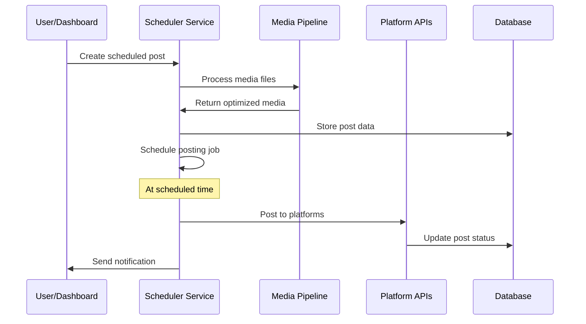
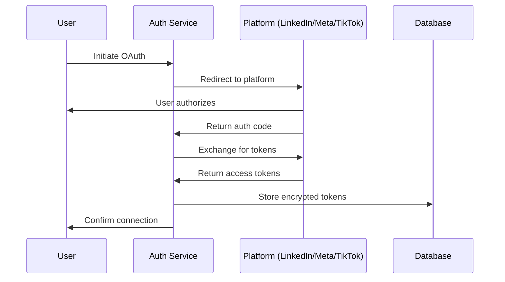

# Technical Architecture

## System Design Overview

### Architecture Pattern: Microservices + Event-Driven

The system follows a microservices architecture with event-driven communication, optimized for scalability and maintainability.

```
┌─────────────────┐    ┌─────────────────┐    ┌─────────────────┐
│   Web Dashboard │    │   Clawdbot API  │    │  Content Engine │
│   (React/Next)  │◄───┤   (Skill API)   │◄───┤  (AI Generator) │
└─────────────────┘    └─────────────────┘    └─────────────────┘
                                │
                                ▼
┌─────────────────────────────────────────────────────────────────┐
│                        Core Services                            │
├─────────────────┬─────────────────┬─────────────────┬───────────┤
│   Scheduler     │  Media Pipeline │  Platform APIs  │ Analytics │
│   Service       │     Service     │     Service     │  Service  │
└─────────────────┴─────────────────┴─────────────────┴───────────┘
                                │
                                ▼
┌─────────────────────────────────────────────────────────────────┐
│                      Data Layer                                 │
├─────────────────┬─────────────────┬─────────────────┬───────────┤
│   PostgreSQL    │     Redis       │   File Storage  │   Queue   │
│   (Primary DB)  │   (Cache/Jobs)  │    (S3/Local)   │ (BullMQ)  │
└─────────────────┴─────────────────┴─────────────────┴───────────┘
```

## Technology Stack

### Backend Services
- **Runtime**: Node.js 18+ with TypeScript
- **Framework**: Fastify (high performance, low overhead)
- **Database**: PostgreSQL 14+ with Prisma ORM
- **Cache/Queue**: Redis 6+ with BullMQ
- **File Storage**: AWS S3 or local filesystem with MinIO
- **Media Processing**: FFmpeg for video/image optimization

### Frontend Dashboard
- **Framework**: Next.js 14 with React 18
- **UI Library**: Shadcn/ui + Tailwind CSS
- **State Management**: Zustand
- **Forms**: React Hook Form + Zod validation
- **Charts**: Recharts for analytics

### Infrastructure
- **Containerization**: Docker + Docker Compose
- **Process Manager**: PM2 for production
- **Monitoring**: Winston logging + optional APM
- **Security**: JWT authentication, rate limiting, CORS

## Core Services Architecture

### 1. Scheduler Service
```typescript
interface SchedulerService {
  schedulePost(postData: PostRequest): Promise<string>
  reschedulePost(postId: string, newTime: Date): Promise<void>
  cancelScheduledPost(postId: string): Promise<void>
  getOptimalPostTimes(platform: Platform, account: Account): PostingWindow[]
}
```

**Responsibilities:**
- Cron job management for scheduled posts
- Optimal timing calculation per platform
- Retry logic for failed posts
- Post queue management

**Implementation:**
- Uses BullMQ for job scheduling
- Integrates with platform-specific posting windows
- Implements exponential backoff for retries

### 2. Media Pipeline Service
```typescript
interface MediaPipelineService {
  processImage(file: Buffer, platform: Platform): Promise<ProcessedMedia>
  processVideo(file: Buffer, platform: Platform): Promise<ProcessedMedia>
  generateThumbnail(videoFile: Buffer): Promise<Buffer>
  optimizeForPlatform(media: Media, platform: Platform): Promise<OptimizedMedia>
}
```

**Responsibilities:**
- Image/video resizing and optimization
- Format conversion per platform requirements
- Thumbnail generation
- Media metadata extraction

**Platform-Specific Processing:**
- **Instagram**: 1:1, 4:5, 9:16 aspect ratios
- **LinkedIn**: 1.91:1, 1:1 aspect ratios
- **TikTok**: 9:16 vertical videos
- **Facebook**: Multiple aspect ratios supported

### 3. Platform APIs Service
```typescript
interface PlatformAPIService {
  authenticate(platform: Platform, credentials: Credentials): Promise<AuthResult>
  postContent(platform: Platform, content: PostContent): Promise<PostResult>
  getAccountInfo(platform: Platform, token: string): Promise<AccountInfo>
  getPostAnalytics(platform: Platform, postId: string): Promise<Analytics>
}
```

**Responsibilities:**
- OAuth flow management
- API rate limiting compliance
- Post publishing to all platforms
- Analytics data retrieval

### 4. Content Engine (AI Integration)
```typescript
interface ContentEngine {
  generateCaption(context: ContentContext, platform: Platform): Promise<string>
  generateHashtags(content: string, platform: Platform): Promise<string[]>
  optimizeForPlatform(baseContent: string, platform: Platform): Promise<OptimizedContent>
  suggestContentIdeas(industry: string, trends: Trend[]): Promise<ContentIdea[]>
}
```

**Responsibilities:**
- AI-powered caption generation
- Platform-specific content optimization
- Hashtag research and generation
- Content idea suggestions

## Data Flow Architecture

### Post Creation Flow


### Authentication Flow


## Security Architecture

### Authentication & Authorization
- **JWT-based authentication** for dashboard access
- **OAuth 2.0 flows** for platform integrations
- **Role-based access control** (Admin, Manager, Client)
- **API key management** for Clawdbot integration

### Data Protection
- **Encryption at rest** for sensitive tokens
- **TLS/HTTPS** for all communications
- **Input validation** with Zod schemas
- **Rate limiting** per user/IP
- **CORS configuration** for frontend security

### Platform Token Management
```typescript
interface TokenManager {
  storeToken(platform: Platform, userId: string, tokens: TokenSet): Promise<void>
  refreshToken(platform: Platform, userId: string): Promise<TokenSet>
  revokeToken(platform: Platform, userId: string): Promise<void>
  validateToken(platform: Platform, token: string): Promise<boolean>
}
```

## Scalability Considerations

### Horizontal Scaling
- **Stateless services** - all state in database/cache
- **Queue-based processing** - async job handling
- **Load balancing** - multiple service instances
- **Database connection pooling** - efficient resource usage

### Performance Optimization
- **Redis caching** for frequent queries
- **Media CDN** for file delivery
- **Database indexing** on query-heavy columns
- **Batch processing** for analytics aggregation

### Resource Management
- **Memory limits** per service container
- **CPU throttling** for media processing
- **Disk space monitoring** for media files
- **Network bandwidth** optimization

## Monitoring & Observability

### Logging Strategy
```typescript
interface Logger {
  info(message: string, context?: object): void
  warn(message: string, context?: object): void
  error(message: string, error: Error, context?: object): void
  debug(message: string, context?: object): void
}
```

### Metrics Collection
- **Post success/failure rates** per platform
- **API response times** and error rates
- **Queue processing times** and backlog size
- **Media processing duration** and file sizes
- **User engagement metrics** aggregation

### Health Checks
- **Service health endpoints** for each microservice
- **Database connection status** monitoring
- **External API availability** checks
- **Queue health** and worker status

## Clawdbot Integration

### Skill Interface
```typescript
interface SocialMediaSkill {
  schedulePost(content: string, platforms: Platform[], time?: Date): Promise<string>
  quickPost(content: string, platforms: Platform[]): Promise<string>
  getAnalytics(timeframe: string): Promise<AnalyticsReport>
  manageAccount(action: AccountAction, platform: Platform): Promise<void>
}
```

### Configuration
```yaml
skill:
  name: "social-media-automation"
  version: "1.0.0"
  permissions:
    - "web_access"
    - "file_storage"
    - "scheduler"
  endpoints:
    - "/api/posts"
    - "/api/analytics"
    - "/api/accounts"
```

This architecture provides a robust, scalable foundation for the social media automation system while maintaining integration capabilities with Clawdbot's ecosystem.